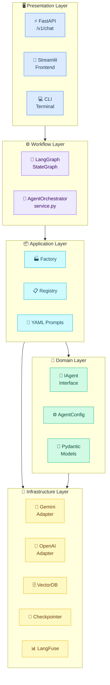
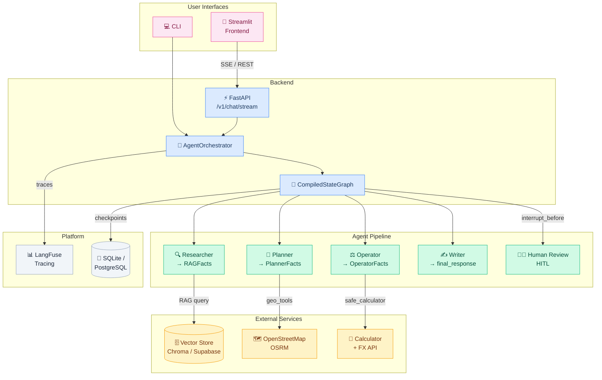

# Architecture Overview

## Clean Architecture layers

## Component diagram

## Technology stack

| Layer | Technology |
|---|---|
| Orchestration | [LangGraph](https://langchain-ai.github.io/langgraph/) |
| LLM abstraction | [LangChain](https://python.langchain.com/) |
| LLM providers | OpenAI · Google Gemini |
| Vector stores | ChromaDB (local) · Supabase pgvector (cloud) |
| REST API | [FastAPI](https://fastapi.tiangolo.com/) |
| Frontend | [Streamlit](https://streamlit.io/) |
| Config | [Dynaconf](https://www.dynaconf.com/) |
| Observability | [LangFuse](https://langfuse.com/) |
| Testing | [pytest](https://pytest.org/) |
