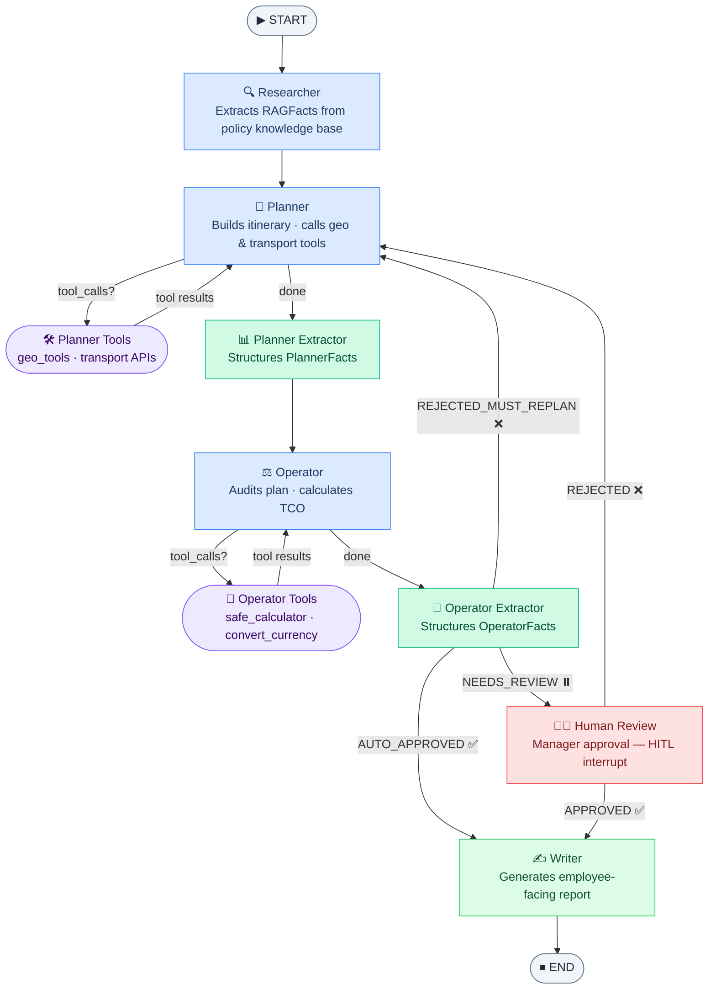
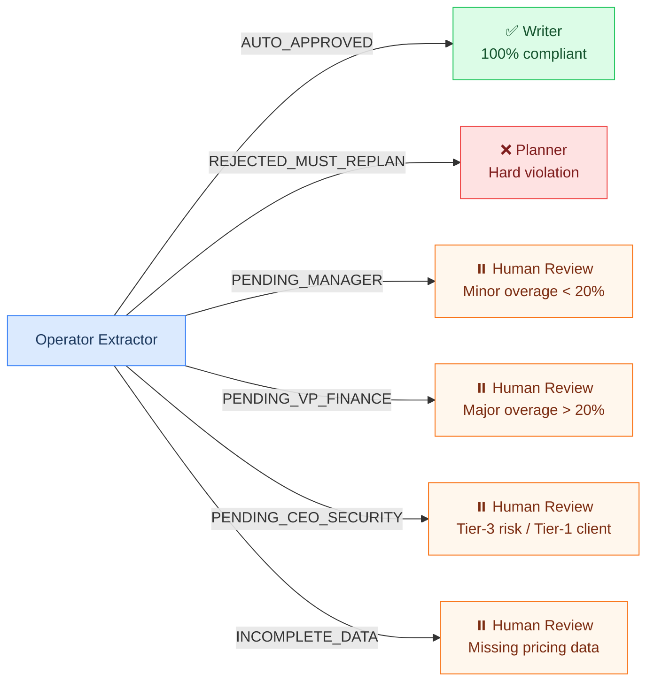

# Agent Pipeline

## Node sequence

## Approval routing

The `OperatorFacts.approval_routing` field controls post-operator routing:

## Human-in-the-Loop (HITL)

When routing reaches **Human Review**, LangGraph suspends execution via `interrupt_before`. The graph state is persisted to the checkpointer. The Manager UI calls `POST /v1/chat/resume` with `approve: true/false` and an optional `feedback` message. The `AgentOrchestrator.aresume_suspended_query()` method injects the decision and resumes execution.
